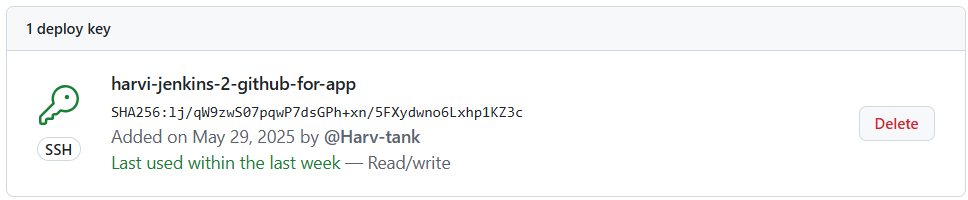
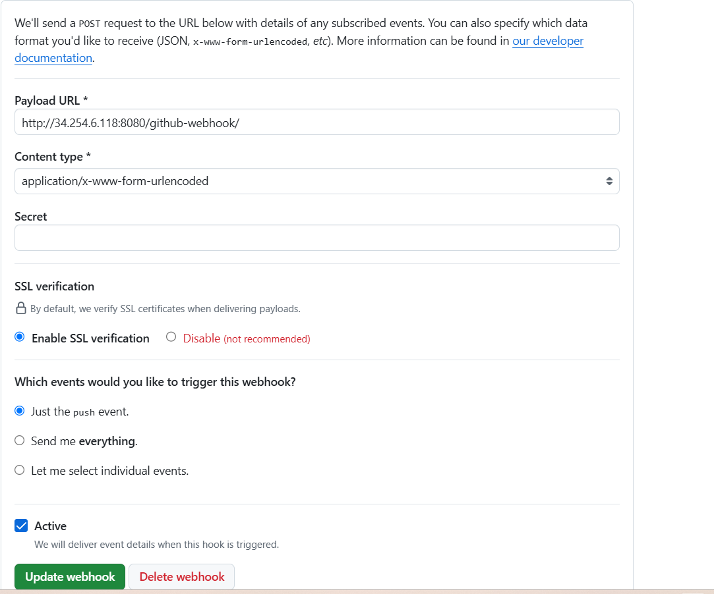
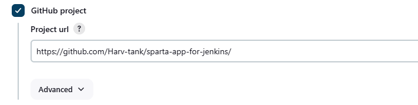
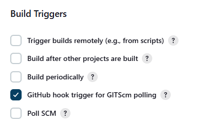
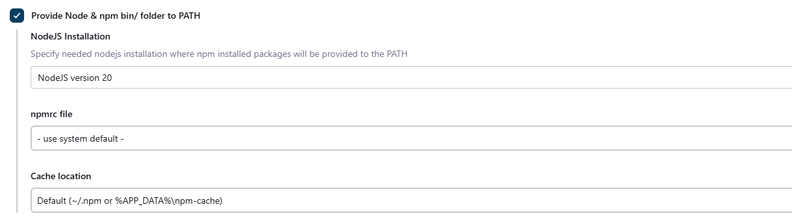
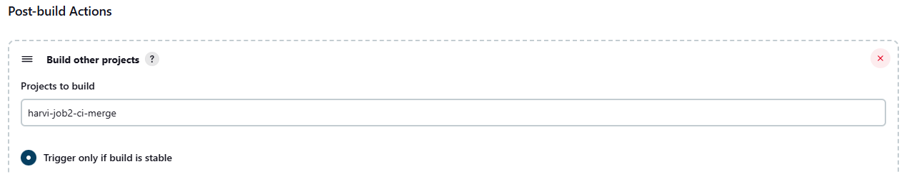
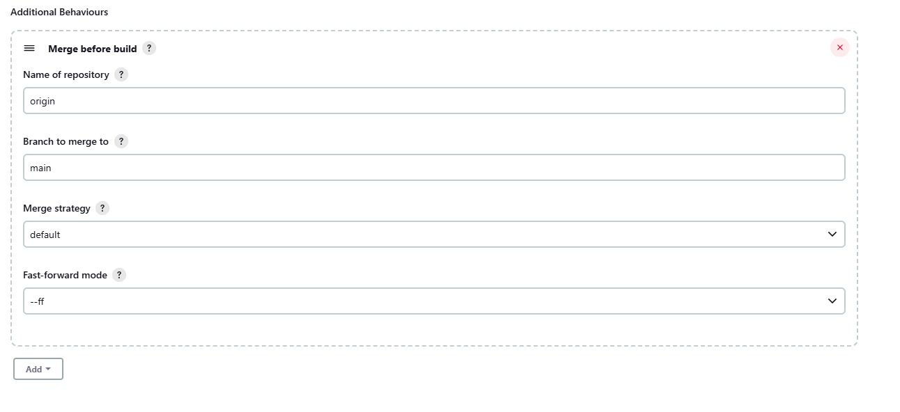
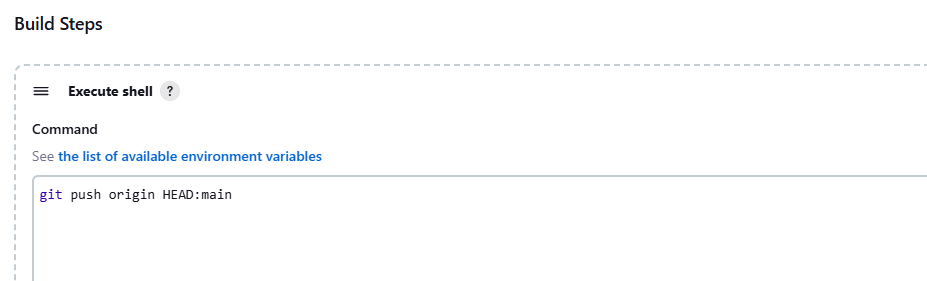
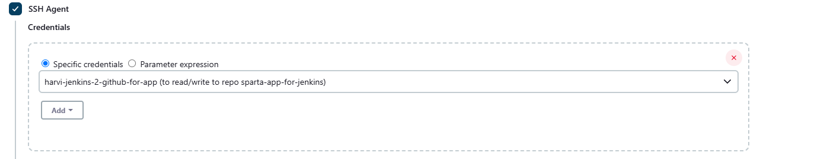

# Jenkins Pipeline

## Introduction of task
- Aim to create a pipline via Jenkins to deploy the sparta global app
- **Job 1** -  Test code using webhook
- **Job 2** -  If tests passed in job 1 it will then trigger Job 2 to then merge changes from dev branch to the main branch

## Configuration before Job 1
1.  Intially had to form a RSA key pair to allow the SSH access which is needed to merge code onto the main branch
- Need to ensure the public key is on our Github repo 


2. Need to configure the Webhook on Git repository for Jenkins to automatically trigger Jenkins jobs when something happens in your Git repository

- The ```url``` used in the ip address of our Jenkins server 

## Job 1

1. This enables the integration with a GitHub project for the Jenkins job where it clones the repo <br> <br>
2. Then need to add the url to allow ssh access using ```git@github.com:Harv-tank/sparta-app-for-jenkins.git``` 
- Also ensure add the private key appropriately allowing read/write access to the repo

3.  
- This will examine the incoming webhook payload to see if it's relevant to the job's SCM (Source Code Management) configuration
- It will then trigger a new build for the job

4. 
- This tells Jenkins to set up a Node.js environment before running your build steps, so that the app can run

5. 
- This ensures that that job 2 is triggered and is built if all the tests are succesful for job 1

## Job 2

- Aim of this job is to push changes made from dev branch to the main branch

**Plugin used :**

- Jenkins will perform a Git merge operation before checking out the code for the build allowing it to merge from ```dev``` branch to the ```main``` branch 
- The build is then executed on the merged result, not on the original source branch or the target branch alone

**BLOCKERS :**
- Intially found that even though the test passed it didn't push the changes to the main branch as instead just commited the changes

**Fix 1 :** 
 
- This command ensures it adds a ```git push``` step after the merge so it can be updated on the Github repo
- **Blocker -** After using this command I ran into another blocker which stated ```git@github.com: Permission denied (publickey). fatal: Could not read from remote repository``` showing it wasn't able to recieve the correct SSH permisions to push the changes


- This SSH agent plugin was able to resolve the problem as it enables the use of an SSH agent within the Jenkins build