# Jenkins Pipeline

**Author:** Harvinder Tank <br>
**Date:** 02/06/2025 
- [Jenkins Pipeline](#jenkins-pipeline)
  - [Introduction of task](#introduction-of-task)
  - [Configuration before Job 1](#configuration-before-job-1)
  - [Job 1](#job-1)
  - [Job 2](#job-2)
  - [Job 3](#job-3)


## Introduction of task
- Aim to create a pipline via Jenkins to deploy the sparta global app
  
  **Continuous Integration :**
- **Job 1** -  Test code using webhook
- **Job 2** -  If tests passed in job 1 it will then trigger Job 2 to then merge changes from dev branch to the main branch
  
  **Continuous Deployment :**
- **Job 3** - After changes have been merged onto the main branch, Jenkins will then run the app on a EC2 instancen with the updated changes


## Configuration before Job 1
1.  Intially had to form a RSA key pair to allow the SSH access which is needed to merge code onto the main branch
- Need to ensure the public key is on our Github repo 
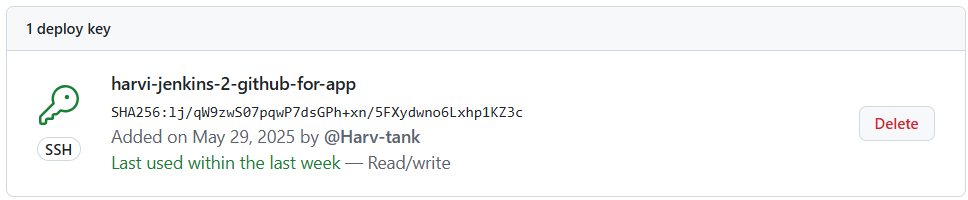

2. Need to configure the Webhook on Git repository for Jenkins to automatically trigger Jenkins jobs when a specific action occurs , in our case it being a push event
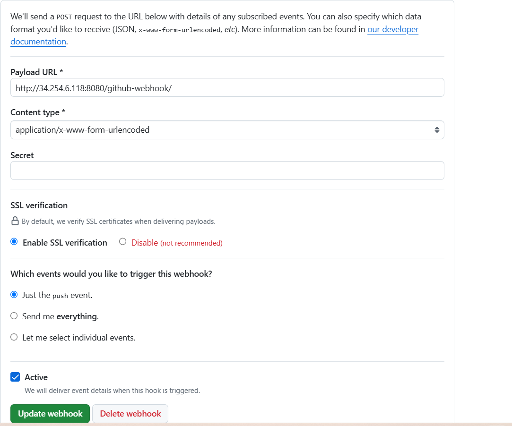
- The ```url``` used in the ip address of our Jenkins server 

## Job 1
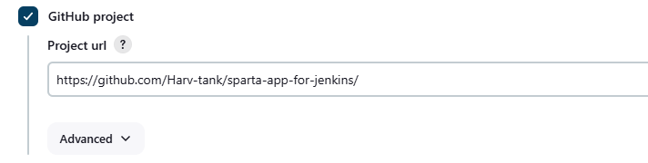
1. This enables the integration with a GitHub project for the Jenkins job where it clones the repo <br> <br>
2. Then need to add the url to allow ssh access using ```git@github.com:Harv-tank/sparta-app-for-jenkins.git``` 
- Also ensure add the private key appropriately allowing read/write access to the repo

3. 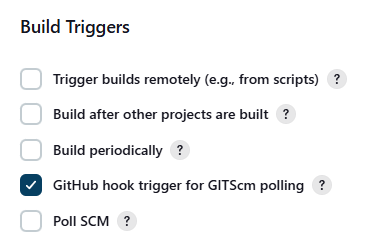 
- This will examine the incoming webhook payload to see if it's relevant to the job's SCM (Source Code Management) configuration
- It will then trigger a new build for the job

4. 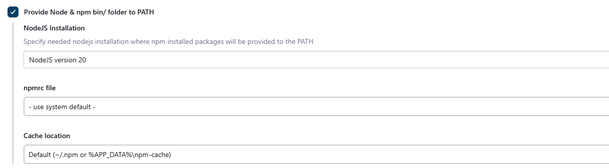
- This tells Jenkins to set up a Node.js environment before running your build steps, so that the app can run

5. 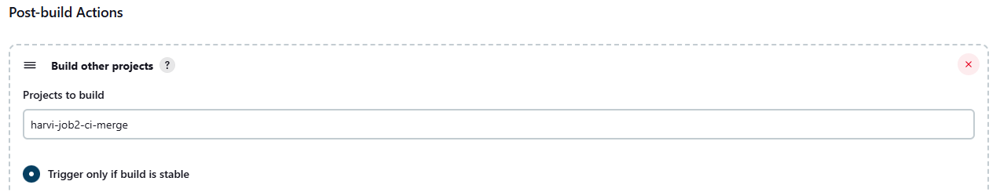
- This ensures that that job 2 is triggered and is built if all the tests are succesful for job 1

## Job 2

- Aim of this job is to push changes made from dev branch to the main branch

**Plugin used :**
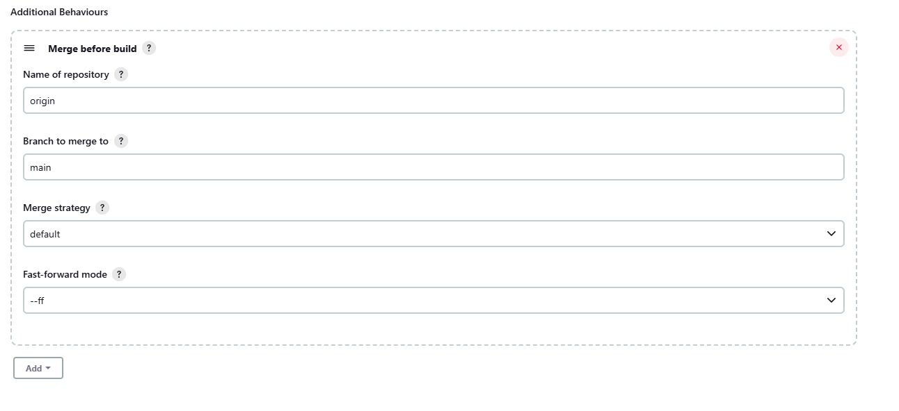
- Jenkins will perform a Git merge operation before checking out the code for the build allowing it to merge from ```dev``` branch to the ```main``` branch 
- The build is then executed on the merged result, not on the original source branch or the target branch alone

**BLOCKERS :**
- Intially found that even though the test passed it didn't push the changes to the main branch as instead just commited the changes

**Fix 1 :** 
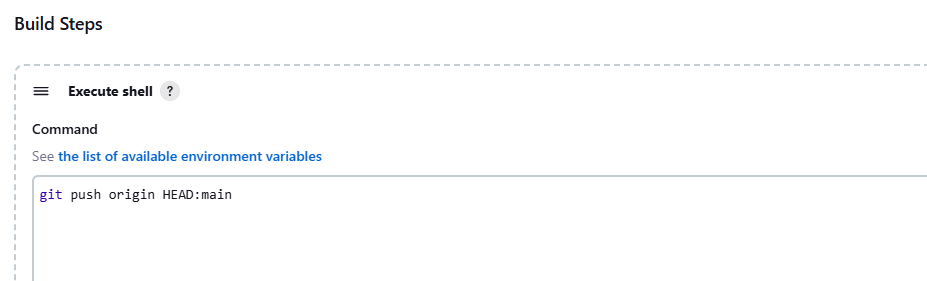 
- This command ensures it adds a ```git push``` step after the merge so it can be updated on the Github repo
- This code pushes the current branch (HEAD which is the result of the merge) to the ```main``` branch of the remote origin.
- **Blocker -** After using this command I ran into another blocker which stated ```git@github.com: Permission denied (publickey). fatal: Could not read from remote repository``` showing it wasn't able to recieve the correct SSH permisions to push the changes

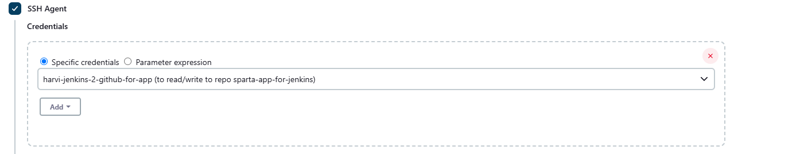
- This SSH agent plugin was able to resolve the problem as it enables the use of an SSH agent within the Jenkins build, which allows changes to be made in the repo

**Fix 2 :** 
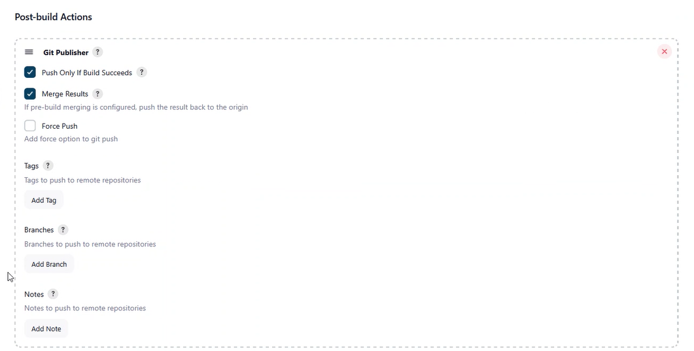
- Oppose to using SSH shell can use ```git publisher``` plugin
- This method doesn't require the ```SSH Agent``` plugin
- Also using this method can remove the ```Merge before build``` pluggin ensuring add branch in the ```add branch``` section 

## Job 3
- Aim to deploy app into EC2 instance
- Copy the updated & tested code from Jenkins to the AWS EC2 instance

1. Create a new EC2 intance with appropriate secuirty groups including :
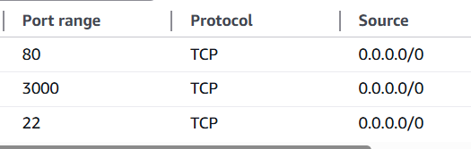
- For best practise DON'T make IP range ```0.0.0.0``` instead should allow just Jenkin's IP to SSH

2. On Jenkins ensure correct credentails are inputted to allow SSH access where I provided details for my private key ```tech504-harvi-aws```
![alt text]images/(image-11.png)

3. In execute shell provided  did a ```scp``` command to copy the code from Jenkins to EC2
- ```scp ```-  securely copies the entire ```app/``` folder from the Jenkins machine to the ```/home/ubuntu/``` directory on the EC2 instance
- ```-o StrictHostKeyChecking=no```  - Prevents SSH from prompting for host verification
- After ubuntu enter the IP address for the EC2 instance
  
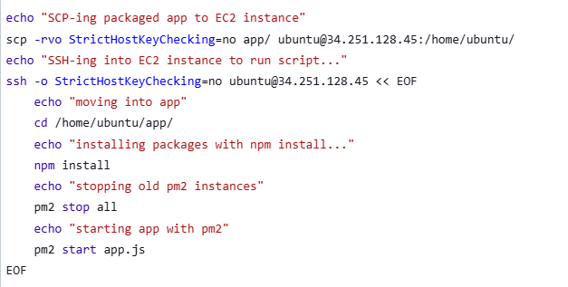

**BLOCKER :** 
- Intially the shell wasn't able to carry out the command for npm install and pm2 as I had not installed the required
- Also had to configure the reverse proxy using ```NGINX``` 

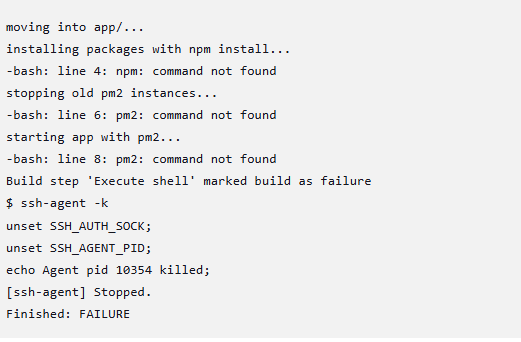
- Therefore, I needed to ```SSH``` into my EC2 instance and form a script which installed the required packages where after doing this the job was succesful and was able to display the app
- The commands I ran for the packages included:
- ```sudo apt update -y```
- ```sudo apt upgrade -y```
- ```sudo apt install nginx -y```
- ```sudo npm install pm2@latest -g```
  
- Also made an edit to the ```index.ejs``` file in the ```views``` folder in the app to specify the time I carried out the test to check the time between pushing the change and it being updated on the app

**OUTPUT :**
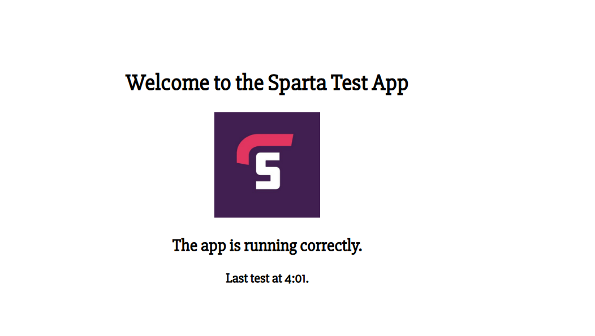